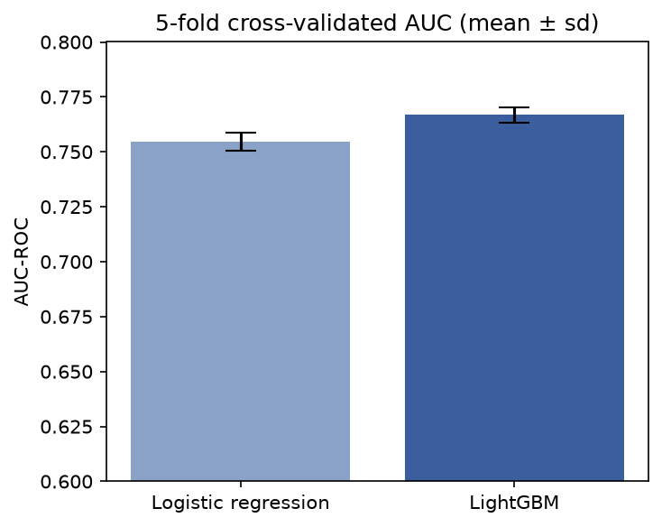
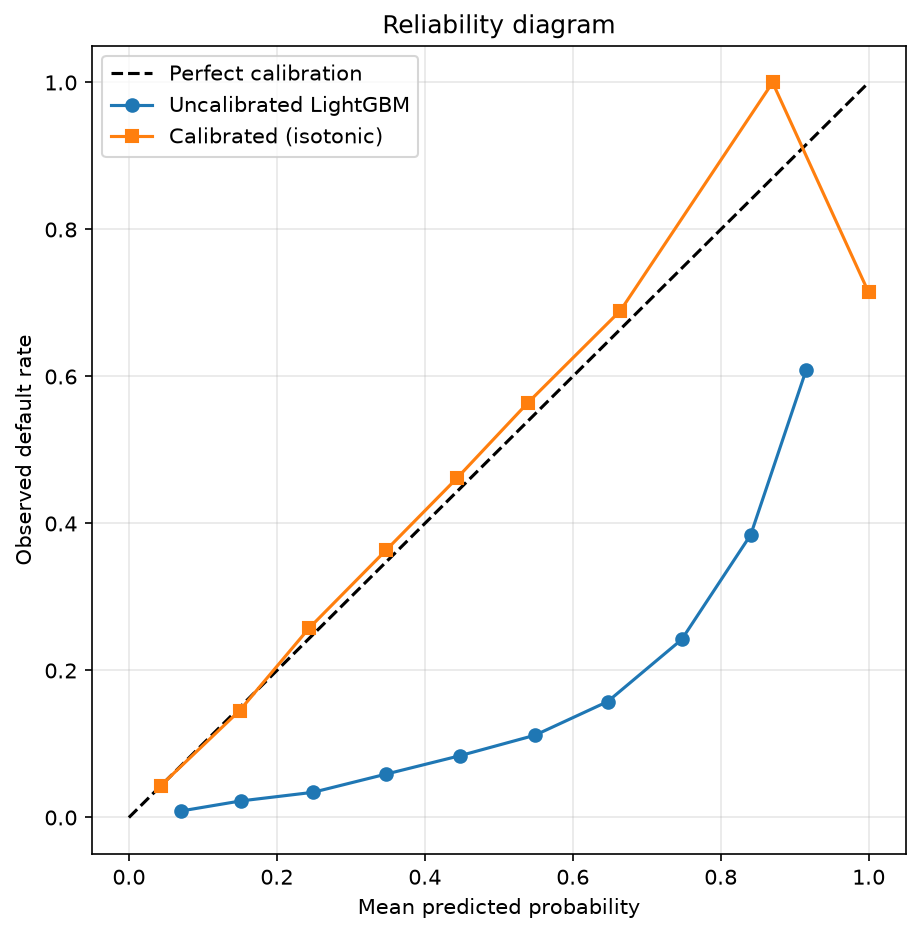
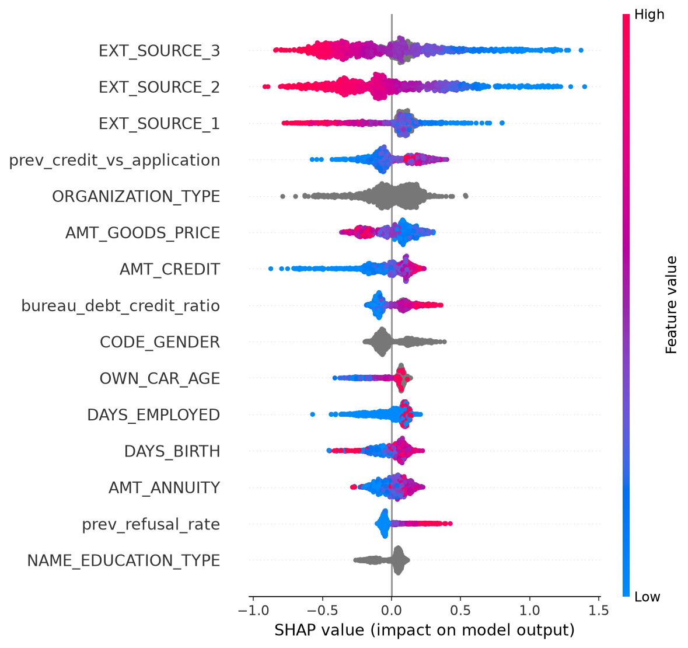
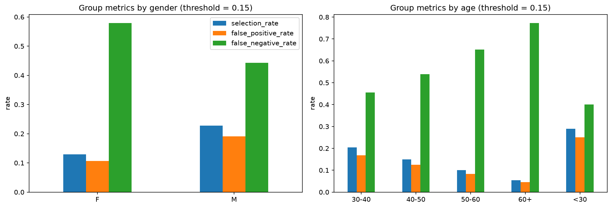

# Credit Default Prediction

Predicting loan default risk on the Home Credit dataset, with a focus on
probability calibration and model explainability — not just maximum AUC.

## Motivation

Machine learning is no longer something only software engineers need to
understand. As an electrical engineer it has become too central to the systems I
work on, and to daily life, to treat as someone else's specialism. I took a
course on Artificial Intelligence during my bachelor's, covering neural networks
and reinforcement learning, and this project is where I refresh that foundation
and extend it with the parts a course does not cover: real data, real class
imbalance, and the decisions that come after a model produces a number.

I deliberately chose a domain my engineering programme never touched. Credit
risk sits in the financial sector, it has consequences for the people it scores,
and it is regulated — which makes it a better teacher than another signal
processing problem would have been.

A credit risk model that only ranks applicants is not enough. A bank prices
loans using expected loss, which requires probabilities that mean what they
say. It has to justify rejections to customers and to regulators, which
requires per-decision explanations. And it has to demonstrate that the model
performs fairly across demographic groups.

This project builds a default prediction model end to end with those
constraints treated as first-class requirements rather than afterthoughts.

## Dataset

[Home Credit Default Risk](https://www.kaggle.com/competitions/home-credit-default-risk):
307,511 loan applications across seven tables, covering the current
application, prior applications with Home Credit, and credit history reported
by other institutions. Target: whether the client had payment difficulties.
Base default rate is 8.1%.

## Results

Each step is measured against the previous one on a single 80/20 split, so the
contribution of every addition is visible:

| Step | Features | Model | AUC-ROC |
|------|----------|-------|---------|
| 1 | 10 numeric main-table columns | Logistic regression | 0.62 |
| 2 | + all categorical columns | Logistic regression | 0.66 |
| 3 | + all main-table features | Logistic regression | 0.XX |
| 4 | + bureau aggregations | Logistic regression | 0.XX |
| 5 | + previous_application aggregations | Logistic regression | 0.73 |
| 6 | same features | LightGBM | **0.77** |

AUC-PR on the final model is 0.26, against a random baseline of 0.08.

### Cross-validated comparison



Single-split numbers carry no error bars, so the final two rows were re-measured
with 5-fold stratified cross-validation over the full dataset, both models sharing
the same folds:

| Model | AUC-ROC |
|-------|---------|
| Logistic regression | 0.7545 ± 0.0042 |
| LightGBM | 0.7668 ± 0.0036 |
| **Paired gain** | **0.0122 ± 0.0013**, LightGBM ahead in 5/5 folds |

**This revised the headline result downward.** On the single split the gap looked
like 0.04; under cross-validation with matched preprocessing it is 0.012. The
difference was not noise — the fold-to-fold spread is only 0.004 — but a weaker
logistic regression baseline in the single-split notebook. Comparing a tuned model
against a carelessly built baseline inflates the apparent gain, and that is
exactly what a cross-validated comparison is for.

The gain that survives is still unambiguous: roughly nine times the spread of the
paired difference, and consistent in every fold. Because both models saw identical
folds, the per-fold difference cancels the variation caused by the split itself —
which is why its standard deviation (0.0013) is three times smaller than that of
either model's own score.

## Calibration



The raw LightGBM output is severely miscalibrated. At a predicted probability
of 0.75, the observed default rate is only about 0.24. The cause is
`class_weight="balanced"`, which up-weights the minority class during training
and inflates output probabilities far above the true 8% base rate. This helps
ranking but makes the scores unusable as probabilities.

The Brier score quantifies the problem. Predicting the base rate of 0.08 for
every client scores about 0.074, so the uncalibrated model at **0.16 performs
worse than a constant prediction** in probabilistic terms, despite its AUC of
0.77. After isotonic calibration on a held-out calibration set the Brier score
falls to **0.065**, below the constant baseline, while AUC is unchanged —
isotonic regression is monotonic, so it re-maps values without altering the
ranking.

## Explainability



The three `EXT_SOURCE` features — normalised scores from external credit
bureaus — dominate the model. Their direction is as expected: higher external
scores push predictions towards lower risk.

Three of the aggregated features built in `src/features.py` rank in the top
fifteen, indicating that the multi-table feature engineering added genuine
signal:

- **`prev_credit_vs_application`** (rank 4) — clients who previously received
  less credit than they applied for are predicted as higher risk.
- **`bureau_debt_credit_ratio`** (rank 8) — a higher share of outstanding debt
  relative to total credit increases predicted risk.
- **`prev_refusal_rate`** (rank 14) — a history of refused applications
  increases predicted risk.

`CODE_GENDER` also appears among the top features and contributes materially
to individual predictions. A model that uses gender as a predictor requires
explicit fairness assessment before deployment could be considered — group-wise
performance and error rates need to be measured, not assumed. This is the
motivation for the fairness analysis below.

## Fairness



Every number here follows from one choice: a decision threshold of 0.15 on the
calibrated probability, giving an overall rejection rate of 16.3% against a true
default rate of 8.1%. That threshold is a business decision, not a property of the
model, and every disparity below scales with it.

| Group | n | True default rate | Rejection rate | FPR | FNR | AUC |
|-------|---|-------------------|----------------|-----|-----|-----|
| Female | 40,561 | 0.070 | 0.129 | 0.107 | 0.579 | 0.758 |
| Male | 20,940 | 0.102 | 0.228 | 0.191 | 0.443 | 0.767 |
| Age <30 | 8,905 | 0.113 | 0.290 | 0.250 | 0.401 | 0.746 |
| Age 30–40 | 16,491 | 0.096 | 0.205 | 0.169 | 0.456 | 0.771 |
| Age 40–50 | 15,299 | 0.076 | 0.150 | 0.124 | 0.539 | 0.764 |
| Age 50–60 | 13,620 | 0.063 | 0.100 | 0.083 | 0.652 | 0.752 |
| Age 60+ | 7,188 | 0.050 | 0.054 | 0.045 | 0.773 | 0.727 |

A third gender category holds two clients and supports no conclusion; because
Fairlearn computes `difference()` against the smallest group, the reported
aggregate gender differences are not the male–female gaps discussed here.

**The rejection gap is larger than the risk gap.** True default rates do differ
between groups, but the model amplifies those differences rather than tracking
them:

| Comparison | Ratio of true default rates | Ratio of rejection rates |
|------------|-----------------------------|--------------------------|
| Male vs female | 10.2% / 7.0% = 1.45 | 22.8% / 12.9% = 1.77 |
| Age <30 vs 60+ | 11.3% / 5.0% = 2.27 | 29.0% / 5.4% = 5.32 |

The same effect read down the age column: every group is rejected more often than
its own default rate, but the multiple falls monotonically from 2.6× for the
under-30s to 1.1× for the over-60s. Young applicants absorb the threshold, older
ones barely feel it — which is why the FNR at 60+ reaches 0.773 and the model
waves through more than three in four defaulters in that group.

This is not a defect to be patched. A fixed threshold on a monotone score
necessarily amplifies base-rate differences, because it cuts into the tail of the
score distribution, where a small shift in the group mean moves a large share of
the mass across the cut.

**The disparity is in outcomes, not in model quality.** AUC stays within
0.727–0.771 across every group, so the model separates defaulters from
non-defaulters about equally well everywhere. The unequal rejection rates come
from groups sitting at different points of the same score distribution under one
global threshold.

**Equal selection rates and equal error rates cannot both hold.** Across age
groups FPR falls from 0.250 to 0.045 while FNR rises from 0.401 to 0.773: groups
rejected more often absorb more false rejections and fewer missed defaults. When
true default rates differ between groups, no single threshold equalises selection
rate, false positive rate and false negative rate simultaneously. Which one to
equalise is a policy decision that determines who bears the cost of the model's
errors.

Before deployment this model would need `CODE_GENDER` removed and the cost in AUC
measured, group metrics reported across a range of thresholds rather than one,
and any fairness constraint applied explicitly — with a stated definition —
rather than left implicit.

## Method notes

- **Split before exploring.** The test set is held out before any EDA or
  feature selection, and touched only for final evaluation.
- **Preprocessing inside the pipeline.** Imputation and scaling statistics are
  learned on training data only and applied unchanged to the test set, making
  leakage through preprocessing structurally impossible.
- **Three-way split for calibration.** The calibration mapping is fitted on a
  separate held-out set the model never saw during training.
- **Aggregation before joining.** The auxiliary tables hold multiple rows per
  client, summarised to one row per client using counts, sums, means, maxima
  and derived ratios before merging.

## Structure

```
credit-default-prediction/
├── data/                         # not tracked — download from Kaggle
├── notebooks/
│   ├── 01_baseline.ipynb
│   ├── 02_categorical.ipynb
│   ├── 03_all_main_features.ipynb
│   ├── 04_bureau_features.ipynb
│   ├── 05_previous_app_features.ipynb
│   ├── 06_lightgbm.ipynb
│   ├── 07_calibration_shap.ipynb
│   ├── 08_fairness.ipynb
│   └── 09_cross_validation.ipynb
├── src/
│   └── features.py               # multi-table aggregation and feature assembly
├── reports/                      # figures
└── README.md
```

## Reproducing

```bash
conda create -n credit python=3.11
conda activate credit
pip install pandas numpy scikit-learn matplotlib seaborn jupyter lightgbm shap fairlearn
```

Download the competition data and unzip it into `data/`, then run the
notebooks in order.

## Planned work

- A reproducible training script (`train.py`) reproducing the final model from
  the command line

## Author

Francisak Prusov — MSc Electrical Engineering, Ghent University (2026).
Built as a self-directed project while moving into applied machine learning.